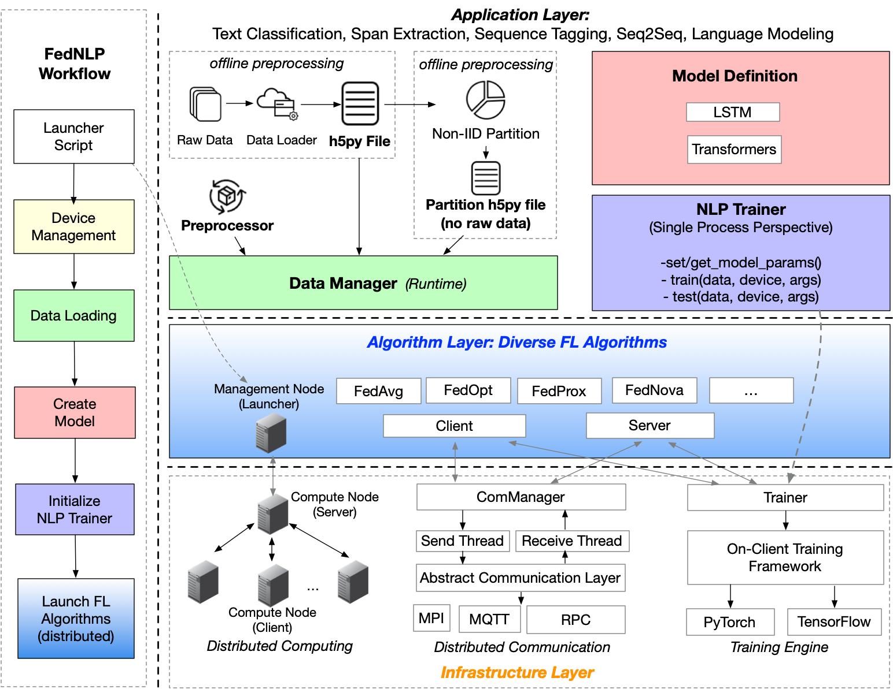

# FedNLP: A Research Platform for Federated Learning in Natural Language Processing
 
<!-- This is FedNLP, an application ecosystem for federated natural language processing based on FedML framework (https://github.com/FedML-AI/FedML). -->

FedNLP is a research-oriented benchmarking framework for advancing *federated learning* (FL) in *natural language processing* (NLP).
It uses FedML repository as the git submodule. In other words, FedNLP only focuses on adavanced models and dataset, while FedML supports various
federated optimizers (e.g., FedAvg) and platforms (Distributed Computing, IoT/Mobile, Standalone).

The figure below is the overall structure of FedNLP.


## Installation
<!-- http://doc.fedml.ai/#/installation -->
After `git clone`-ing this repository, please run the following command to install our dependencies.

```bash
conda create -n fednlp python=3.7
conda activate fednlp
# conda install pytorch==1.6.0 torchvision==0.7.0 cudatoolkit=10.1 -c pytorch -n fednlp
pip install torch==1.6.0+cu101 torchvision==0.7.0+cu101 -f https://download.pytorch.org/whl/torch_stable.html
pip install -r requirements.txt 
pip uninstall transformers
pip install -e transformers/
cd FedML; git submodule init; git submodule update; cd ../;

# For Evaluation NLG
# pip install git+https://github.com/google-research/bleurt.git
# cd ~/fednlp_data/
# wget https://storage.googleapis.com/bleurt-oss/bleurt-base-128.zip .
# unzip bleurt-base-128.zip
```

## Code Structure of FedNLP
<!-- Note: The code of FedNLP only uses `FedML/fedml_core` and `FedML/fedml_api`.
In near future, once FedML is stable, we will release it as a python package. 
At that time, we can install FedML package with pip or conda, without the need to use Git submodule. -->

- `FedML`: a soft repository link generated using `git submodule add https://github.com/FedML-AI/FedML`.


- `data`: provide data downloading scripts and raw data loader to process original data and generate h5py files. Besides, `data/advanced_partition` offers some practical partition functions to split data for each client.

Note that in `FedML/data`, there also exists datasets for research, but these datasets are used for evaluating federated optimizers (e.g., FedAvg) and platforms.
FedNLP supports more advanced datasets and models.

- `data_preprocessing`: preprocessors, examples and utility functions for each task formulation.

- `data_manager`: data manager is responsible for loading dataset and partition data from h5py files and driving preprocessor to transform data to features.

- `model`: advanced NLP models. You can define your own models in this folder.

- `trainer`: please define your own `trainer.py` by inheriting the base class in `FedML/fedml-core/trainer/fedavg_trainer.py`.
Some tasks can share the same trainer.

- `experiments/distributed`: 

    1. `experiments` is the entry point for training. It contains experiments in different platforms. We start from `distributed`.
    2. Every experiment integrates FIVE building blocks `FedML` (federated optimizers), `data_manager`, `data_preprocessing`, `model`, `trainer`.
    3. To develop new experiments, please refer the code at `experiments/distributed/transformer_exps/fedavg_main_tc.py`.

- `experiments/centralized`: 

    1. This is used to get the reference model accuracy for FL. 


## Data Preparation
In order to set up correct data to support federated learning, we provide some processed data files and partition files. Users can download them for further training conveniently.

If users want to set up their own dataset, they can refer the scripts under `data/raw_data_loader`. We already offer a bunch of examples, just follow one of them to prepare your owned data!
### download our processed files from Amazon S3.
Dwnload files for each dataset using these two scripts `data/download_data.sh` and `data/download_partition.sh`.

We provide two files for each dataset: data files are saved in  **data_files**, and partition files are in directory **partiton_files**. You need to put the downloaded `data_files` and `partition_files` in the `data` folder here. Simply put, we will have `data/data_files/*_data.h5` and `data/partition_files/*_partition.h5` in the end.

## Experiments for Centralized Learning (Sanity Check)

### Transformer-based models 

First, please use this command to test the dependencies.
```bash
# Test the environment for the fed_transformers
python -m model.fed_transformers.test
```

Run Text Classification model with `distilbert`:

```bash 
DATA_NAME=20news
CUDA_VISIBLE_DEVICES=1 python -m experiments.centralized.transformer_exps.main_tc \
    --dataset ${DATA_NAME} \
    --data_file ~/fednlp_data/data_files/${DATA_NAME}_data.h5 \
    --partition_file ~/fednlp_data/partition_files/${DATA_NAME}_partition.h5 \
    --partition_method niid_label_clients=100_alpha=1.0 \
    --model_type distilbert \
    --model_name distilbert-base-uncased  \
    --do_lower_case True \
    --train_batch_size 8 \
    --eval_batch_size 8 \
    --max_seq_length 256 \
    --learning_rate 1e-1 \
    --epochs 20 \
    --evaluate_during_training_steps 500 \
    --output_dir /tmp/${DATA_NAME}_fed/ \
    --n_gpu 1
```


## Experiments for Federated Learning

We already summarize some scripts for running federated learning experiments. Once you finished the environment settings, you can refer and run these scripts including `run_text_classification.sh`, `run_seq_tagging.sh` and `run_span_extraction.sh` under `experiments/distributed/transformer_exps`.


<!-- ### Update FedML Submodule 
This is only for internal contributors, can put this kind of info to a seperate readme file.
```
cd FedML
git checkout master && git pull
cd ..
git add FedML
git commit -m "updating submodule FedML to latest"
git push
```  -->


## Citation
Please cite our FedNLP and FedML paper if it helps your research.
```bib
@inproceedings{fednlp2021,
  title={FedNLP: A Research Platform for Federated Learning in Natural Language Processing},
  author={Bill Yuchen Lin and Chaoyang He and ZiHang Zeng and Hulin Wang and Yufen Huang and M. Soltanolkotabi and Xiang Ren and S. Avestimehr},
  year={2021},
  booktitle={arXiv cs.CL 2104.08815},
  url={https://arxiv.org/abs/2104.08815}
}
```

```
@article{chaoyanghe2020fedml,
  Author = {He, Chaoyang and Li, Songze and So, Jinhyun and Zhang, Mi and Wang, Hongyi and Wang, Xiaoyang and Vepakomma, Praneeth and Singh, Abhishek and Qiu, Hang and Shen, Li and Zhao, Peilin and Kang, Yan and Liu, Yang and Raskar, Ramesh and Yang, Qiang and Annavaram, Murali and Avestimehr, Salman},
  Journal = {arXiv preprint arXiv:2007.13518},
  Title = {FedML: A Research Library and Benchmark for Federated Machine Learning},
  Year = {2020}
}
```

 
