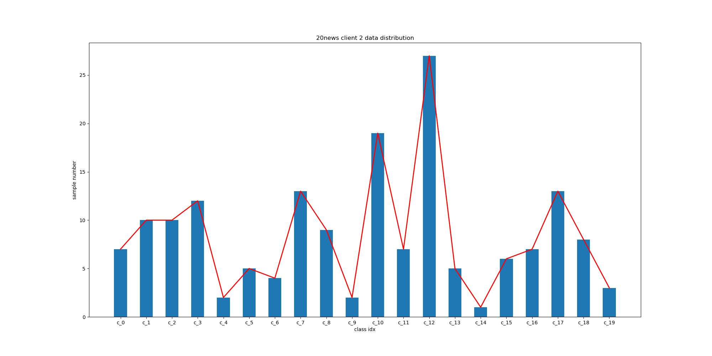
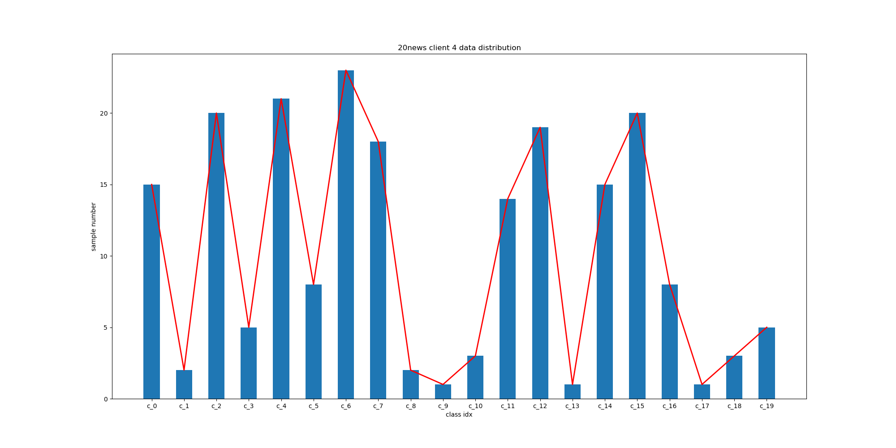

# Advanced Partition Method
We provide two non-iid partition methods. You can dowoload the our datasets and the partitioned data 
```sh
wget --no-check-certificate --no-proxy https://fednlp.s3-us-west-1.amazonaws.com/data_and_partition_files.zip
unzip data_loaders_and_partition.zip
```
or follow the instruction below to partition your own dataset.

## BERT-based Clustering 
We first use sentence transformer to compute the embedding of the data and then run kmeans to gets K clusters based on client numbers.


```bash
# overwrite switch stores False the default value is True

python -m data_preprocessing.advanced_partition.kmeans  \
    --client_number 10 \
    --data_file '/home/bill/fednlp_data/data_files/wikiner_data.h5' \
    --bsz 16 \
    --partition_file '/home/bill/fednlp_data/partition_files/wikiner_partition.h5' \
    --embedding_file '/home/bill/fednlp_data/embedding_files/wikiner_embedding.pkl'  \
    --task_type name_entity_recognition \
    --overwrite  

python -m data_preprocessing.advanced_partition.kmeans  \
    --client_number 30 \
    --data_file '/home/bill/fednlp_data/data_files/squad_1.1_data.h5' \
    --bsz 16 \
    --partition_file '/home/bill/fednlp_data/partition_files/squad_1.1_partition.h5' \
    --embedding_file '/home/bill/fednlp_data/embedding_files/squad_1.1_embedding.pkl'  \
    --task_type reading_comprehension \


python -m data_preprocessing.advanced_partition.kmeans  \
    python kmeans_ex.py  \
    --client_number 50 \
    --data_file '/home/bill/fednlp_data/data_files/cornell_movie_dialogue_data.h5' \
    --bsz 16 \
    --partition_file '/home/bill/fednlp_data/partition_files/cornell_movie_dialogue_partition.h5' \
    --embedding_file '/home/bill/fednlp_data/embedding_files/cornell_movie_dialogue_embedding.pkl'  \
    --task_type seq2seq \

```
<!-- ```sh
python -m data_preprocessing.advanced_partition.kmeans_ex  \
    --client_number 100 \
    --data_file 'data/data_files/20news_data.h5' \
    --partition_file 'data/partition_files/20news_partition.h5' \
    --embedding_file 'data/embedding_files/20news_embedding.h5'  \
    --task_type text_classification
``` -->
## LDA
we first kmeans to classify data in to {10,30,50} clusters and then apply LDA to distribute data in to different number of groups as defined in client number

we already provide clusters data for datasets excluding **20news**, **agnews**, **sentiment140**, **sst2** because they have their own natural classification. In the each of the rest partition h5 files, you can access the clustering data by the keyword "**kmeans_%client_number**" based on how many client number you assign in the Kmeans partition and you can also find which data belongs to which cluster under the keyword **kmeans_%client_number/cluster_assignment** . If you would like to create different numbers of clusters you can use the kmeans code we provide above
### usage

```bash
python -m data_preprocessing.advanced_partition.lda  \
--client_number 100 \
--data_file 'data/data_files/20news_data.h5' \
--partition_file 'data/partition_files/20news_partition.h5' \
--task_type text_classification \
--kmeans_num 0 \
--min_size 10 \
--alpha 1.0
```


```bash
python -m data_preprocessing.advanced_partition.lda  \
--client_number 100 \
--data_file 'data/data_files/wikiner_data.h5' \
--partition_file 'data/partition_files/wikiner_partition.h5' \
--task_type name_entity_recognition \
--kmeans_num 10 \
--min_size 10 \
--alpha 1.0
```

```bash
python -m data_preprocessing.advanced_partition.lda  \
--client_number 100 \
--data_file 'data/data_files/squad_1.1_data.h5' \
--partition_file 'data/partition_files/squad_1,1_partition.h5' \
--task_type reading_comprehension \
--kmeans_num 30 \
--min_size 10 \
--alpha 1.0
```

```bash
python -m data_preprocessing.advanced_partition.lda  \
--client_number 100 \
--data_file 'data/data_files/cornell_movie_dialogue_data.h5' \
--partition_file 'data/partition_files/cornell_movie_dialogue_partition.h5' \
--task_type seq_to_seq \
--kmeans_num 50 \
--min_size 10 \
--alpha 1.0
```
## datasets stats
every data is round to 0.01
**cornell_movie_dialogue** **squad_1.1** **wnut** **wikiner** datasets are presented with 2 general data ditribution graph from LDA and Kmeans partiton. The rest of the datasets are presented with LDA data distribution because we use their natural labels to construct LDA  instead of using kmeans to create labels 

All of the datasets are presented with 4 randomly chosen clients data distrabution graphs to demonstrate actual data heterogeneity in each clients
### 20news 

|data|LDA|
|-----| -----| 
|client_number|100|
|sample_total|18846|
|sample_mean|188.46|
|sample_std|25.51|
|std/mean|0.13|
|class_num|20|







### agnews
|data|LDA|
|-----| -----|
|client_number|100|
|sample_total|127600|
|sample_mean|1276|
|sample_std|520.64|
|std/mean|0.41|
|class_num|4|


### sst2
|data|LDA|
|-----| -----| 
|client_number|100|
|sample_total|8741|
|sample_mean|87.41|
|sample_std|49.67|
|std/mean|0.57|
|class_num|2|
### sentiment 140
|data|LDA|
|-----| -----| 
|client_number|100|
|sample_total|1600498|
|sample_mean|16004.98|
|sample_std|9535.35|
|std/mean|0.60|
|class_num|2|

### cornell_movie_dialogue 
|data|LDA|Kmeans|
|-----| -----| ---|
|client_number|100|50|
|sample_total|221616|221616|
|sample_mean|2216.16|4432.32|
|sample_std|155.06|1752.57|
|std/mean|0.07|0.40|
|class_num|50|50|

### squad_1.1
|data|LDA|Kmeans|
|-----| -----| ---|
|client_number|100|30|
|sample_total|122325|122325|
|sample_mean|1223.25|4077.5|
|sample_std|143.40|1776.99|
|std/mean|0.118|0.44|
|class_num|30|30|
### w_nut
|data|LDA|Kmeans|
|-----| -----| ---|
|client_number|100|10|
|sample_total|4681|4681|
|sample_mean|46.81|468.1|
|sample_std|10.87|119.38|
|std/mean|0.23|0.26|
|class_num|10|10|
### wikiner
|data|LDA|Kmeans|
|-----| -----| ---|
|client_number|100|10|
|sample_total|286495|286495|
|sample_mean|2864.95|28649.5|
|sample_std|645.72|3050.49|
|std/mean|0.22|0.11|
|class_num|10|10|